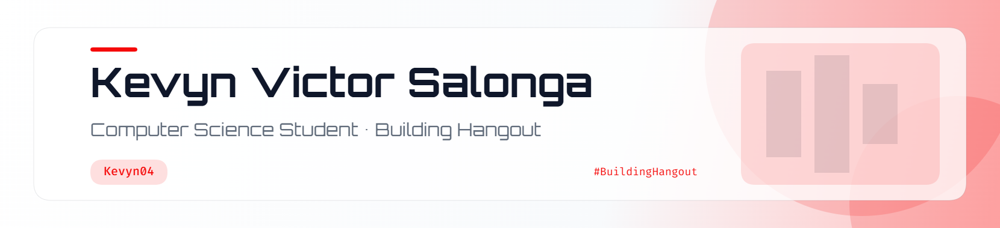

<picture>
  <source media="(prefers-color-scheme: dark)" srcset="Kevyn04-banners/header-dark.png">
  
</picture>

  

# Hey there, I'm Kevyn 👋

 

 

## 🔴 About Me

<table>
  <tr>
    <td width="65%" valign="top">
      <h3>Nice to meet you!</h3>
      
I'm <strong>Kevyn</strong>, a computer science student who enjoys building apps that bring people together.

      

        🔭 I'm currently building <strong>Hangout</strong>, an app for finding nearby events and activities. 
        🌱 I'm learning more about software development as I build and improve my projects. 
        💬 Ask me about <strong>Hangout, coding projects, or what I'm working on next</strong>. 
        ✨ Outside of code, I enjoy <strong>[YOUR_INTERESTS]</strong>.
      

    </td>
    <td width="35%" align="center" valign="middle">
      
    </td>
  </tr>
</table>

 

## 🛠️ Tech Stack

<!-- Remove or add icons to match the technologies you actually use. -->

  

## 📈 GitHub Activity

 

 

## 🐍 Contribution Snake

<!--
This section needs a GitHub Action that generates the snake images and
publishes them to an output branch. Until that is set up, the image
below will not appear.
-->
<picture>
  <source media="(prefers-color-scheme: dark)" srcset="https://raw.githubusercontent.com/Kevyn04/Kevyn04/output/github-contribution-grid-snake-dark.svg">
  
</picture>

  

## 🔗 Let's Connect

<!-- Replace these placeholders with your real links. Remove badges you do not want to share. -->

  

